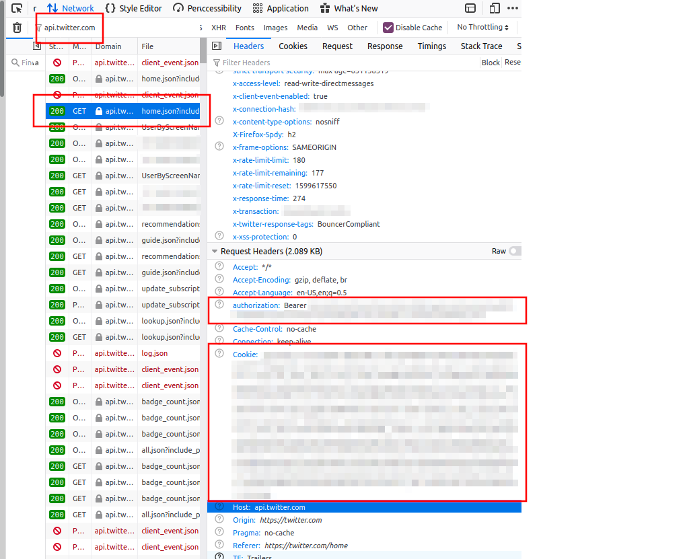

## Twitter Account Creation Date

### Setup

```bash
python3 -m venv env
source env/bin/activate
pip install requests
```

Add your usernames to the file `usernames.txt`, one per line

Open your browser, open the browser devtools, and visit any Twitter
webpage. On the Network tab of the devtools, type `api.twitter.com` into
the search filter and click on any GET request. On the `Headers` subtab,
copy the value from the `Authorization` request header (_only_ the value, begins with `Bearer`) to the `config.py` `auth_header` variable. Repeat this
for the `Cookie` header value (usually begins with `_ga`) and paste it into
the `cookie_header` config variable.



### Running

Output to terminal:

```bash
source /env/bin/activate  # if virtualenv is not already activated
python3 profile_info.py
```

Output to CSV file:

```bash
source /env/bin/activate  # if virtualenv is not already activated
python3 profile_info.py > data.csv
```

Output to both terminal _and_ CSV file:

```bash
source /env/bin/activate  # if virtualenv is not already activated
python3 profile_info.py | tee output.csv
```